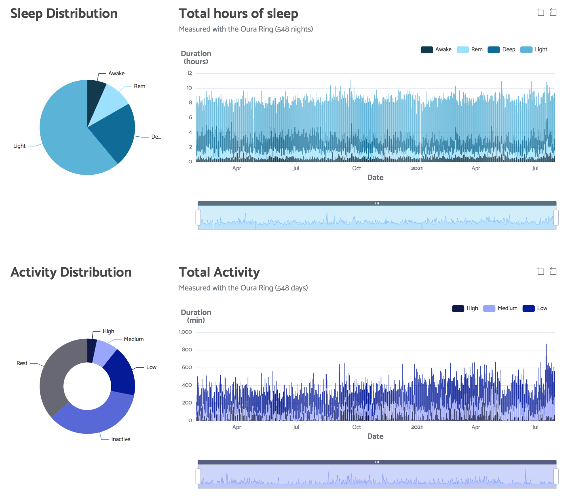
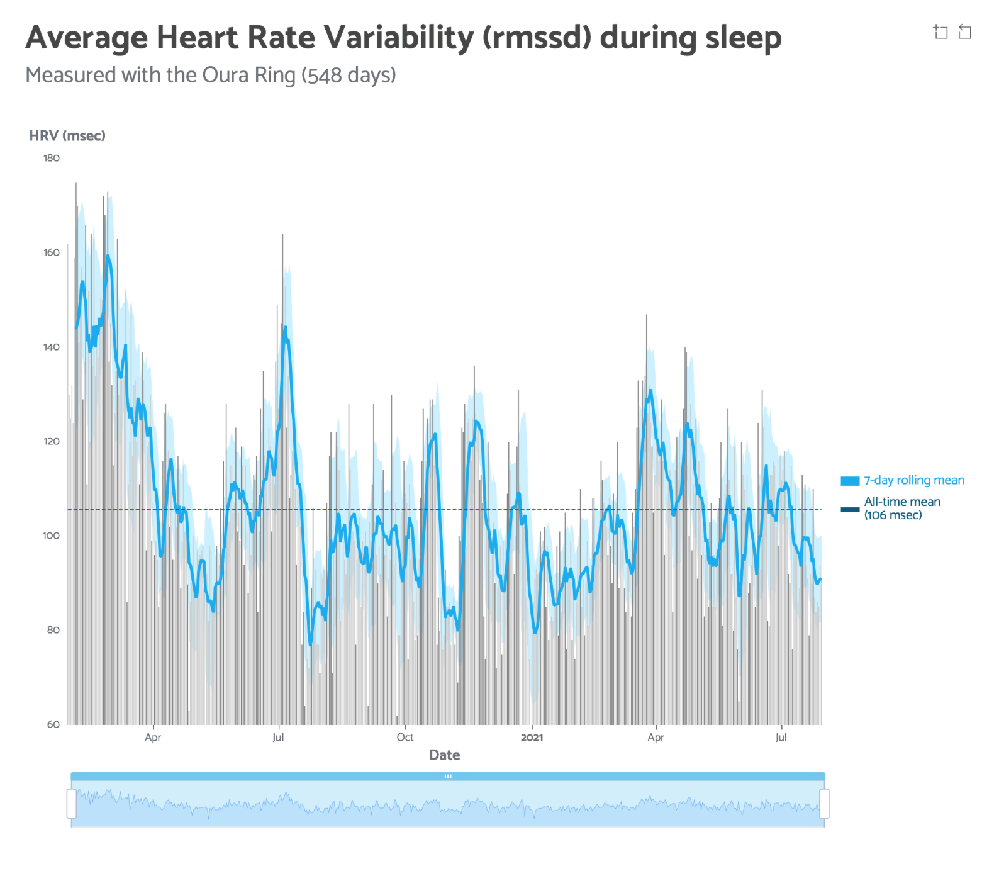

# echarts4r_oura
I have been exploring the `{echarts4r}` package by [John Coene](https://github.com/JohnCoene/echarts4r) to create interactive graphs for my sleep, activity and readiness data from the **Oura ring**

More info on [my website](https://jebentwatjemeet.nl/2021/07/10/echarts4r) (in Dutch).

### `e_gauge()` and `e_bar()`
 

### `e_pie()` and `e_bar()`
 

### `e_line()` and `e_band2()`
 

### `e_calendar()`
 

